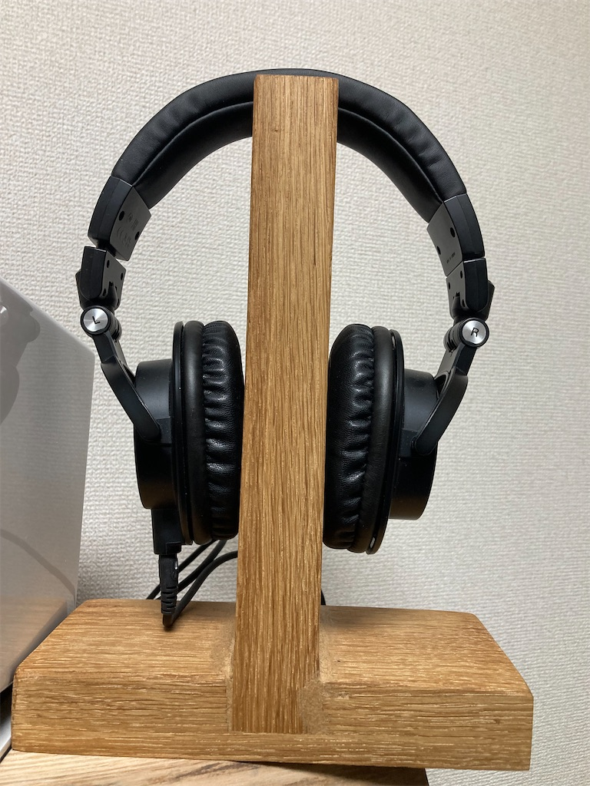
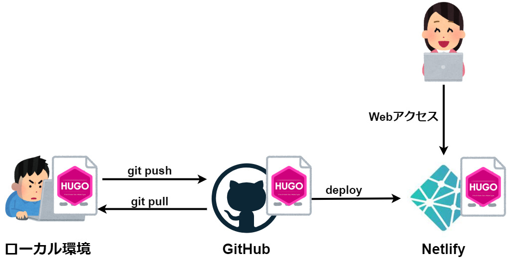

<!-- _class: title -->
# SSGのHugoで構築する私のblog


<!--
_color: white
_footer: 'Photo by Earl Lasala on Unsplash'
-->


---
# はじめにお断り

「以下の仕組みでプレゼン資料を作ったら、効率化できるか？」を試行してます。

- Marpで書く
- GitHubActionsによるCI/CD


<!--
_color: white
-->


---
# 自己紹介


- 趣味として木工職人の道を邁進中
  - ソファテーブル（実装済み）
  - デスクシェルフ（実装済み）
  - ヘッドホンスタンド（写真）




---
# 発表するに至った経緯

1. 加齢とともに、すぐに忘れてしまう
2. 何回もググるけど、それでも忘れる
3. アウトプットすれば、記憶が定着するかも
4. ブログとして、技術的なメモを未来の自分に残そう！
5. 約2年ブログを運用
6. システム開発やっているとブログの仕組みについて話す機会がないので、話してみたいと思った


---
# このLTで得られるもの

- SSGとは何かを知る
- Hugoというツールの存在を知る
- 私のブログを読める（←宣伝）
  - バカも休み休み Yeah（ https://yamada-tech-memo.netlify.app/ ）

# このLTで得られないもの

- 趣味の話なので、直接業務への活用は難しいです。ごめんなさい。

---
# アジェンダ

- SSGとは何か
- SSG登場の背景
- SSGのメリット
- SSGのツールHugoとは
- 私のブログ環境
  - 実際に運用している構成を紹介


---
## SSGとは？

- Static Site Generator（Generation）
- あらかじめ静的なファイル（html、css、JavaScript）を作成してサイトを構築する


---
## SSG登場の背景：CMSの覇者 WordPressの課題


- シェア84%　CMSにおける覇者
- 記事管理はデータベース
- クライアントがアクセスするたびにhtmlを***動的生成***
- 動的生成のため、大量リクエスト発生時はデータベースがボトルネックに
- 構成要素が多く、セキュリティ対策が必要
  - セキュリティパッチ適用が日々の運用になりがち

<!--
_color: white
-->


---
## SSG登場の背景：整ってきた環境

- htmlやcssを自動で生成
  - CI/CDが一般的になってきた
- 無料、安価なホスティングサービス
  - Netlify
  - Vercel
  - S3,CloudFront
  

<!--
_color: white
-->


---
## SSGのメリット


- 表示スピードが速い
  - 静的ファイルを表示するだけ
- CDNでスケールしやすい
  - 静的ファイルの強み
- セキュリティリスクが低い
  - html、CSSで表現している

---
## Hugoとは

- Hugo is 何？
  - golangで実装されたSSG（[Hugo公式](https://gohugo.io/)）
  - 他にGatsby（React）、jekyll（Ruby）なども有名
- Hugoの特徴
  - markdownで記事を書ける
  - buildが速い 約2500記事のbuildで約20秒
```
                   |  EN   
-------------------+-------
  Pages            | 2476  


Built in 19447 ms
```
---
### 私のblog環境

記事をGitHubにPUSH → 自動でビルドしてNetlifyにデプロイ。




---
## この環境の良いところ

- イケてる感
  - techなスタートアップのblogに採用されている例も
  - ツヨツヨなエンジニア感を出せる
- 無料の範囲でできる
- 好みのエディタで書ける（例：VSC、Sakuraエディタ）
- 記事管理はGitHub
  - 複数人で記事を書くことができる
  - プルリク、レビュー、マージなどの運用も可能
  - GitHub Actionsで誤字脱字やデッドリンクのチェック等をCIで

<!--
_color: white
-->


---
## この環境のイマイチなところ

- GitHub、git、markdown等、ある程度の習熟が必要
- スマホで書くには不向き
  - 手軽に書けるとは言えない
- 記事検索の実装は技術が必要
  - JavaScriptのライブラリFuse.js、Algoliaのような検索サービス
- 1文字変更するだけでも、全てのページを再作成
  - 無駄感はある
- Netlifyはたくさん使うと課金対象
  - 例：ビルド300分/1ヶ月を超える

<!--
_color: white
-->


---
## おわりに

明日の自分は忘れている。

これからも明日の自分に書きます！

<!--
_footer: 'Photo by jet dela cruz on Unsplash'
-->

